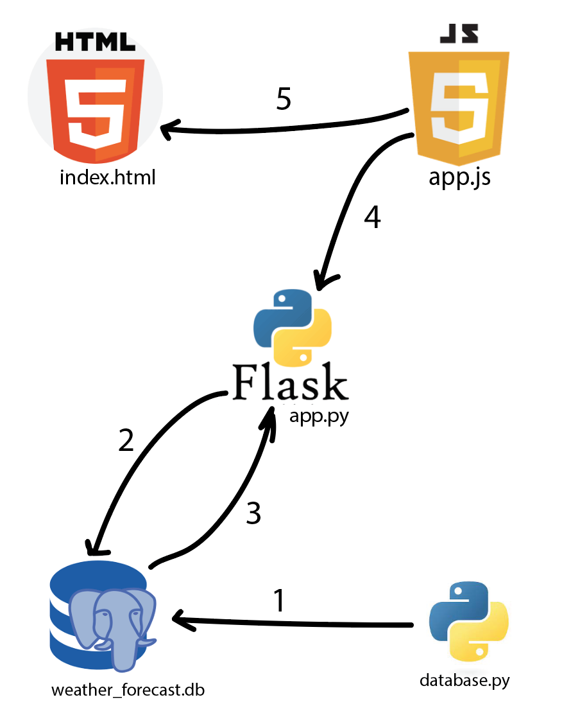

# full_stack_app

## requirements:
- Postgres database: create a database on your local postgres database under the name ```weather```
- run the `database.py` to load the data from API to Postgres database "this could be any process to get the data from the source back to the database and apply the full ETL process if needed" so it's not only for extracting data but it involves all the steps of transforming and loading the data
- run `python app.py` to start flask Application:
  - `/` endpoint loads `index.html` which shows the webpage
  - `/get_weather` endpoint reads the data from postgres table `weather_forecast` and provide the data to `app.js` to render the data on the webpage
- please refer to the following graph for the flow of development of the application
 
